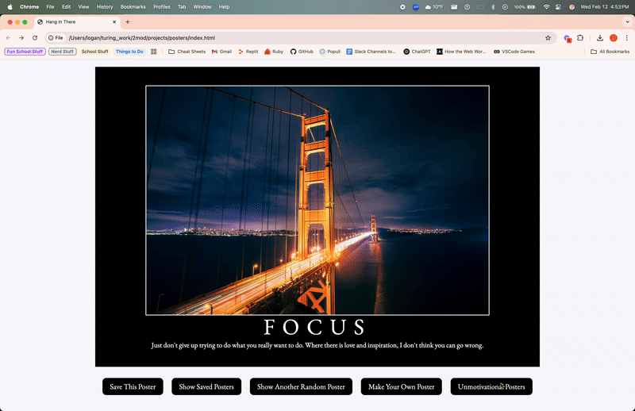

# Hang in There  

### Abstract: 
-In this project we built an app that on load displays a random image, title and quote on the home page. We also have a button that will give us a new random poster, title and quote. The save this poster button saves the currently displayed poster into an array so that when you click on the show saved posters button it takes you to a new page that shows all of the posters that you have saved. There is also a make your own poster button that allows you uto upload your own image, title and quote and display it on the main page. You can also save your created poster to the saved posters array. Finally we added an Unmotivational Posters button that takes you to a new page that has 15 other unmotivational posters. Within this page you can double click on the poster and it will delete that poster. 

[//]: <> (Briefly describe what you built and its features. What problem is the app solving? How does this application solve that problem?)

### Installation Instructions:
-To clone down the app and get it running one would have to go to my personal GitHub page and my repos and get the SSH code. Once you have that open your terminal, open up whatever directory you would like the application to be stored in and then use `git clone <ssh URL>` and then `code .` to open up your text editor. Once inside the application, run `open html.index` to open up the webpage in a browser. 
[//]: <> (What steps does a person have to take to get your app cloned down and running?)

### Preview of App:

-Okay I think I was able to upload my gif on here. If not I do apologize! I have 
[//]: <> (Provide ONE gif or screenshot of your application - choose the "coolest" piece of functionality to show off. gifs preferred!)

### Context:
- I am currently in Mod 2 here at Turing and this was our first project. This project was a lot of fun! I really enjoyed being able to directly see what was happending as I would build out the project. It was very nice that we had so much time to work on this project, I did use all ten days to complete it but that is only because I was able to space out my time. It was very nice to be able to only work on the project a little bit at a time so that I was really absorbing all of the information. 
[//]: <> (Give some context for the project here. How long did you have to work on it? How far into the Turing program are you?)

### Contributors:
- I did get a lot of help with this project, especially towards the end. Will and I spent some time together on Sunday working through the 4th iteration. I alo reached out to Shadeau, Beverly and a few other classmates when I had some issues to work out. 

- I am still working on getting my [LinkedIn Profile](https://www.linkedin.com/in/ldsauer/) to reflect my previous work history and future aspirations. That's a project for this weekend. 
[GitHub Profile](https://github.com/ldsauer)
[//]: <> (Who worked on this application? Link to your GitHub. Consider also providing LinkedIn link)

### Learning Goals:
- Some learning goals for this project were to work with HTML, CSS and JavaScript and to have them all communicate with each other to create a functioning webpage. As far as tech that helped me, Google was definitely my best friend! Along with MDN web docs, w3 schools and chatGPT. I really found chatGPT helpful when I would need to talk through a problem. I could have converstaions with it to help me grasp some aspects that were a little fuzzy. 
[//]: <> (What were the learning goals of this project? What tech did you work with?)

### Wins + Challenges:
- As far as wins go, I would say that completing this project was a huge win for me! I was not able to finish the first project in Mod 1 so that was a big accomplishment for me. Another win for me was how well I grasped what we were working with. Again in Mod 1 it took me a couple weeks to really understand how writing code worked but I was able to pick up and understand what we were doing much more quickly. I would say another win is that I feel that I came out of my social anxiety bubble a bit and reached out to fellow classmates for help more than I did in Mod 1. It was still a little difficult for me to ask for help but I think that I was able to rip the band aid off a bit and will be more comfortable moving forward. 

- I would say that the biggest challenge I faced was at the end of iteration 5 so that when you navigate away from the Unmotivational Posters page the posters that you deleted stayed deleted when navigating away from the page and then returning back. I was stuck on this problem for about 3 days. To solve this I reached out to several of my classmates and a lot of them were also stumped as to why my functionality was not working. I finally posted to the code-help channel and Beverly and Will had just solved that very probelm so they were able to help me out. Huge shout out to them!! 
[//]: <> (What are 2-3 wins you have from this project? What were some challenges you faced - and how did you get over them?)
